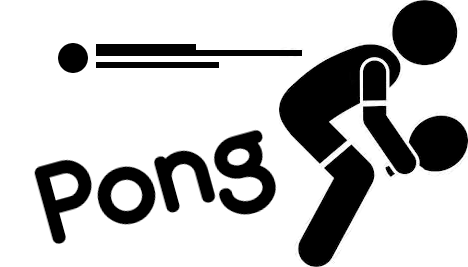
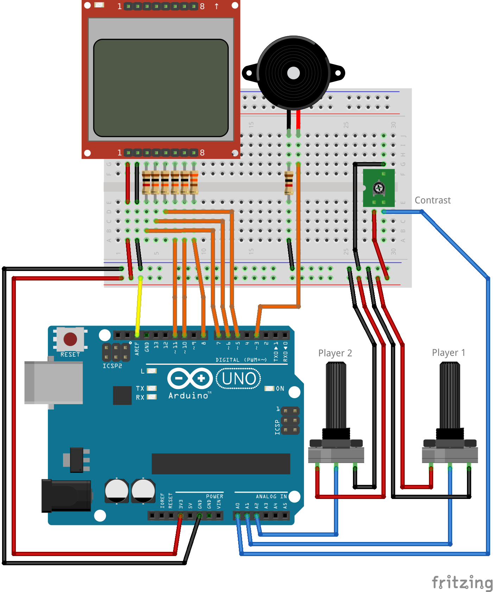
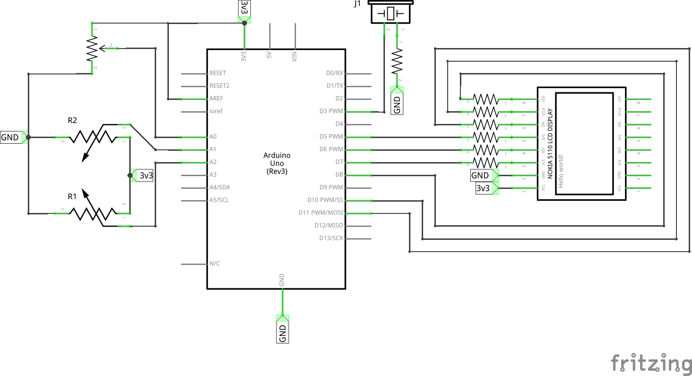
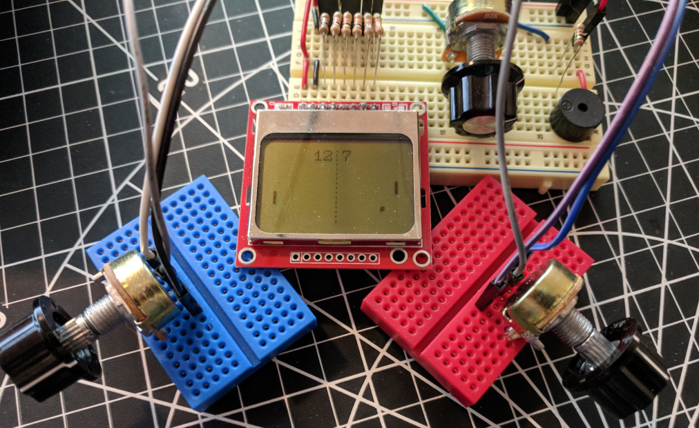

# Arduino Pong

This Pong clone is a learning project for the Arduino Uno (or similar).

It uses a simple potentiometer or each player's "controller," and an additional
one to control the LCD screen's contrast. The buzzer plays a tone when a player
scores, as well as provides feedback when the ball bounces on the wall or a
player's paddle.

The title screen graphic and scoreboard font where created with
[img2pcd8544](https://github.com/sangster/img2pcd8544). You should be able to
easily drop in your own assets using this tool as well.

You can play with [the schematic file](pong.fzz) using the open source tool,
[Fritzing](http://fritzing.org).

## Convenience Library

This project was built using the
[libsangster_avr](https://github.com/sangster/libsangster_avr) convenience
library. You will need a local copy of this library to build this project.
However, it is a header-only library, so it should be as simple as installing
these header files to your `avr-gcc`'s `include/` directory.

## Hardware Configuration

### Bill of Goods

 - Arduino Uno (Rev.3)
 - Nokia 5110 LCD
 - Rotary Potentiometer (x3)
 - Piezo Speaker
 - 330 Ω Resistor
 - 1k Ω Resistor (x2)
 - 10k Ω Resistor (x4)
 - Jumper wires (various)

### Breadboard Layout

### Schematic Layout

### Build Notes

 - Don't forget to connect `3V3` to `AREF`. Otherwise the player controllers
   won't have full 10-bit resolution. If you can't move a paddle to the top or
   bottom of the screen, this is likely why.
 - Player 1's controller directions are reversed. We assume that the players
   are sitting on opposite sides of the screen.

## Photo

